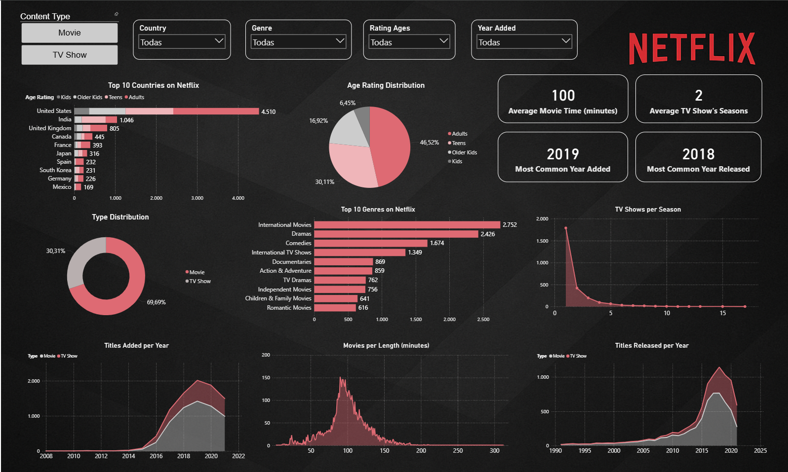
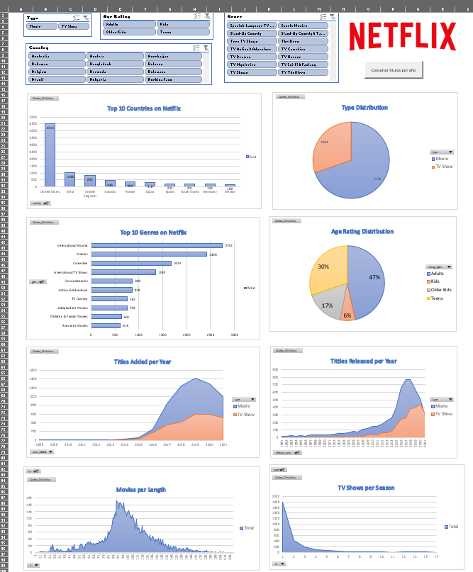
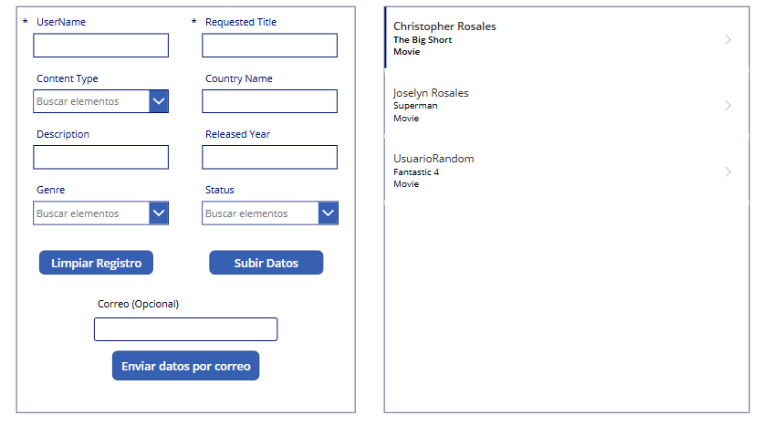
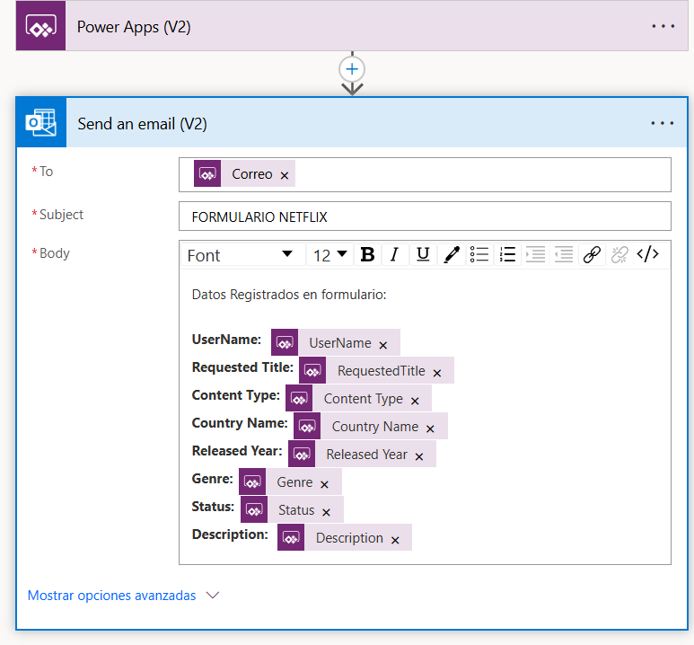
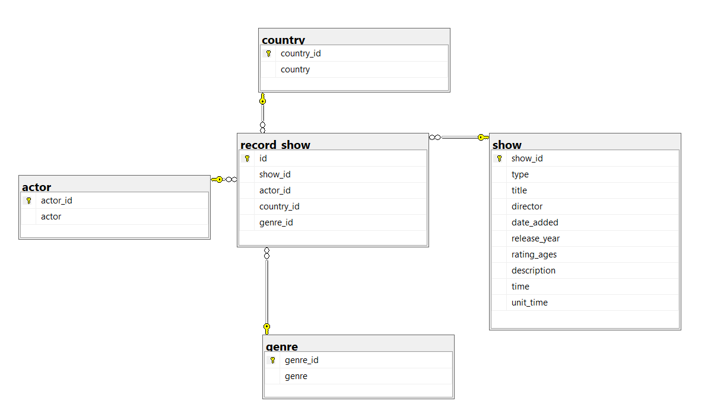

# Proyecto de Análisis de Datos - Dataset Netflix

## 📌 Descripción General del Proyecto
Este proyecto consiste en realizar un análisis de datos basado en el dataset público **"Netflix Movies and TV Shows"** de Kaggle, con el objetivo de simular la base técnica que podría usar un startup para desarrollar una plataforma de streaming similar a Netflix.

---

## 📂 Estructura del Proyecto

### **1. Limpieza y preparación de datos con Python**
- Se lee el dataset original y se realiza un proceso de **limpieza** para identificar valores nulos, inconsistencias y caracteres especiales que puedan afectar el procesamiento.
- Se generan **4 tablas de dimensiones** (`actor`, `country`, `genre`, `show`) y **1 tabla de hechos** (`record_show`), exportadas como archivos **.csv**.
- Carpeta: **`Christopher-Rosales/Python/`**
  - `Dataset/` → Contiene el dataset original.
  - `Nuevas_Vistas/` → Contiene las tablas finales generadas.
  - `Limpieza.ipynb` → Código en Jupyter Notebook para la limpieza y transformación.

---

### **2. Modelado y carga de datos en SQL Server**
- Se diseña un **diagrama físico** de base de datos siguiendo un **modelo estrella normalizado**.
- Creación de la base de datos local **`Netflix`**.
- Carga de datos desde los archivos CSV generados en Python.
- Carpeta: **`Christopher-Rosales/SQL/`**
  - Scripts de creación de tablas.
  - Backup de la base de datos.

---

### **3. Visualización de datos en Excel**
- Conexión de SQL Server a Excel mediante **Power Query**.
- Modelado de datos con **Power Pivot**.
- Creación de **tablas y gráficos dinámicos**.
- Implementación de **macros VBA** para consultas rápidas (botón **"Consultar Títulos por Año"**).
- Carpeta: **`Christopher-Rosales/Excel/`**
  - Archivo habilitado para macros con visualizaciones.

---

### **4. Visualización de datos en Power BI**
- Conexión directa a SQL Server.
- Diseño de un dashboard interactivo con **gráficos y KPIs**.
- Publicación en la nube de Power BI.
- **[Ver Dashboard Online](https://app.powerbi.com/view?r=eyJrIjoiZDE2NDMxNjEtNzNmNy00OTdhLTliNjMtZDgyODQ3M2MxYTJkIiwidCI6IjFkZjQ2ODhjLWI5MTUtNDEwMy05OGMwLTNhMzY4ZmIyOTNlOCJ9)**
- Carpeta: **`Christopher-Rosales/Power BI/`**
  - `Dashboard_Netflix.pbix` → archivo editable.

---

### **5. Desarrollo de aplicación con Power Apps y Power Automate**
- Creación de **Canvas App** conectada a lista de SharePoint para registrar y consultar sugerencias de contenido.
- Integración con **Power Automate** para envío automático de correos electrónicos con datos del formulario.
- Carpeta: **`Christopher-Rosales/Power App/`**
  - Archivos de la aplicación.

---

### **6. Análisis de Resultados**
- Identificación de **tendencias** y **patrones** en la data.
- Insights para el desarrollo de una plataforma similar a Netflix:
 - `Informe_Resultados_Netflix.docx`

---

## ▶️ Instrucciones de Ejecución

1. **Descargar** el repositorio completo.
2. Ejecutar `Limpieza.ipynb` en **Python** para generar los CSV.
3. Ejecutar el script SQL (`Query.sql`) en SQL Server para crear la base de datos y tablas e importar los CSV.
4. Abrir `Dashboard_Netflix.pbix` en Power BI para explorar el análisis.
5. Probar la aplicación en Power Apps y registrar una sugerencia.
6. Revisar la carpeta **Gallery/** para ver capturas de reportes y modelos.

---

## 📷 Ejemplos Visuales

**Dashboard Power BI**

**Reporte Excel**

**Aplicación Power Apps**

**Flujo Power Automate**

**Diagrama Modelo Relacional**

